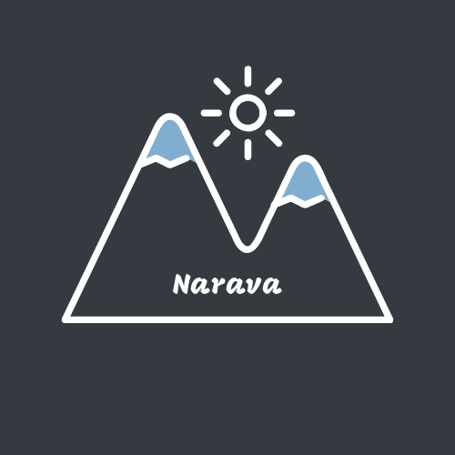

Narava

by Isaiah Santillan
Carolina Code School Final Project!

This is an Application that allows users to post GPS enabled photos that grabs the exact location and places it on a map
for others and yourself to see.
Users have the ability to post images and see others images along with the exact location.
You are able to search areas and see images that were taken within a certain distance of the initial destination you searched.

Technologies used for this application:
 
* Django(version 2.1.7)

* GeoDjango

* Google Maps Reverse Geocoding API

* djangorestframework(version 3.9.2)

* boto3(version 1.9.122)

* exifread(version 2.1.2)

* piexif(version 1.1.2)

* pillow(version 5.4.1)

* Amazon S3 bucket(signature version 2)

* Heroku

* postgis(postgres database)

* Javascript

* React.js

* Python

* HTML

* CSS

